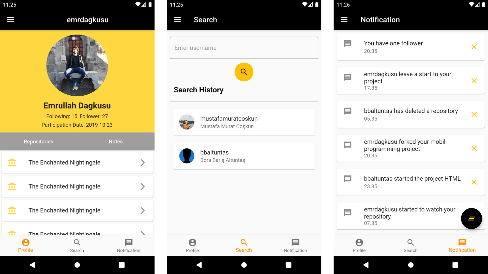
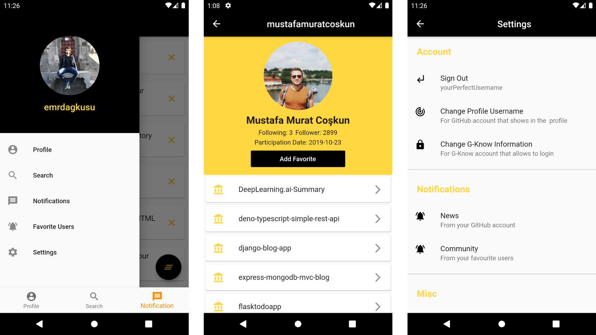

# G-Know

G-Know is a flutter application devloped via using firebase, firestore and public api (in this case it is GitHub's api).

## You can:
* Register and login into your account
* See your profile with the information of your repositories and notes
* Fetch advices from firestore database
* Create a list with your favorite users
* Keep your search history on your local database
* See any user's profile with their repository names and with their profile and repositories information
* Save your ideas in the note part of your profile
* Create a reminder hourly or daily and get notification

## Getting Started

## Parts of the project:
**A. User Interface:** In this part, it is expected that build up the UI of the app. 
**B. Getting Data from the Web:** In this part, it is expected that modify the app so that it can get the necessary data
from the web API used in the app and display it in the corresponding views of the app. 
**C. Local Database & Firebase:** In this part, it is expected that modify the app so that it stores the data it takes
from the web API into both a local database and remote database on Cloud Firestore, and queries the database to
display the information. 
**D. Services, Notifications, and Broadcast Receivers:** In this part, it is expected that modify the app so that it uses
services and broadcast receivers as well as a notification system. 
